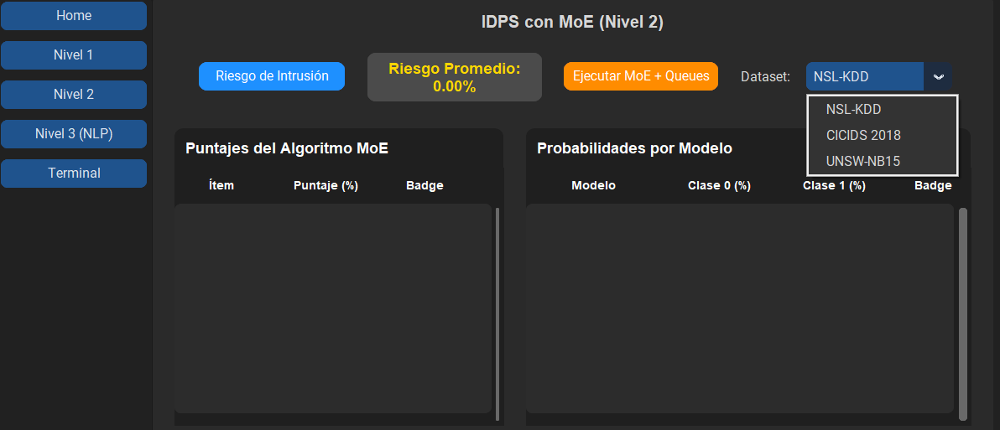
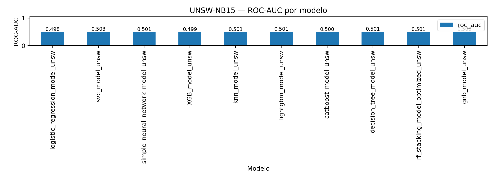

# 🛡️ IDS-ML Thesis · Sistema Experimental de Detección de Intrusiones


> **Trabajo de graduación:** *Construcción de un algoritmo de ciberseguridad con base en diferentes modelos matemáticos en inteligencia artificial.*

**IDS-ML Thesis** es un sistema experimental para detectar y analizar intrusiones en tráfico de red, este integra preprocesamiento, clasificación con Machine Learning, calibración de probabilidades, priorización de alertas y correlación entre modelos ML, Snort, Suricata y Zeek.

<p align="center">
  
</p>

---

## ✨ Qué incluye

- Evaluación sobre **NSL-KDD**, **CICIDS2018** y **UNSW-NB15**.
- Modelos clásicos, boosting, red neuronal, stacking y mezcla de expertos.
- Calibración de probabilidades y métricas de clasificación.
- Procesamiento experimental de PCAP y logs de Snort, Suricata y Zeek.
- Correlación de alertas mediante claves canónicas, intersecciones y similitud de Jaccard.
- Interfaz local para captura, resultados MoE, consultas NLP y orquestación.

---

## 🏗️ Arquitectura

```text
CSV / PCAP / logs de red
          │
          ▼
Preprocesamiento
          │
          ▼
Modelos ML + calibración
          │
          ├── Métricas y matrices de confusión
          ├── Mezcla de expertos (MoE)
          └── Priorización por confianza
                    │
                    ▼
Correlación: Snort + Suricata + Zeek + ML
                    │
                    ▼
Intersecciones y Jaccard
```

---

## 🧠 Datasets y modelos

| Área | Incluye |
|---|---|
| Datasets | NSL-KDD, CICIDS2018 y UNSW-NB15. |
| Modelos | Regresión logística, KNN, GaussianNB, árbol de decisión, Random Forest, SVC, XGBoost, LightGBM, CatBoost y red neuronal simple. |
| Ensambles | Stacking y artefactos de mezcla de expertos (MoE). |
| Métricas | Accuracy, precision, recall, F1-score, ROC-AUC, especificidad y exactitud balanceada. |
| Correlación | Snort, Suricata, Zeek y predicciones ML. |

---

## 📊 Resultados representativos

Los valores corresponden a ejecuciones concretas del proyecto y deben interpretarse según el dataset, particionado, variables seleccionadas y configuración de cada motor.

| Dataset | Mejor F1-score registrado | Observación |
|---|---:|---|
| NSL-KDD | 99.85% | Resultados de clasificación y correlación multifuente. |
| CICIDS2018 | 99.99% | Evaluación binaria con modelos de boosting. |
| UNSW-NB15 | 66.17% | Línea base que requiere ajuste y evaluación adicional. |

<p align="center">
  
</p>

---

## 🖥️ Interfaz

La interfaz se organiza en cuatro áreas:

```text
Nivel 1  → Captura de tráfico y características extraídas
Nivel 2  → Resultados MoE y priorización por colas
Nivel 3  → Consultas y explicaciones NLP
Terminal → Orquestación de módulos experimentales
```

---

## 📁 Estructura principal

```text
IDS-ML-Thesis/
├── README.md
├── LICENSE
├── requirements.txt
├── assets/readme/
├── src/Container/
│   ├── extensions/Auto/
│   ├── extensions/Queue/
│   ├── jsons/
│   ├── nivel_2/
│   └── nivel_3/
├── nsl_ids/
└── unsw_ids/
```

---

## ⚙️ Instalación

```bash
git clone https://github.com/SalazarPaulo/IDS-ML-Thesis.git
cd IDS-ML-Thesis
```

**Windows PowerShell**

```powershell
py -3.12 -m venv .venv
.\.venv\Scripts\Activate.ps1
pip install -r requirements.txt
```

**Linux / WSL / macOS**

```bash
python3.12 -m venv .venv
source .venv/bin/activate
pip install -r requirements.txt
```

Los módulos principales están ubicados en:

```text
src/Container/extensions/Auto/preprocess.py
src/Container/extensions/Auto/calibrated_predict.py
src/Container/extensions/Auto/sub_automaton.py
src/Container/extensions/Queue/sub_queues.py
```
---

## ⚠️ Alcance y limitaciones

- Proyecto orientado a investigación académica y evaluación offline.
- Un resultado alto en un dataset no garantiza el mismo desempeño en una red real.
- La correlación depende de las reglas activas, el procesamiento del PCAP, la ventana temporal y la definición de evento.
- No debe utilizarse como sistema autónomo de prevención en producción.

---

## 👨‍💻 Autor

**Paulo Salazar**  
GitHub: [@SalazarPaulo](https://github.com/SalazarPaulo)

---

## 📄 Licencia

El código fuente se distribuye bajo la licencia **PolyForm Noncommercial 1.0.0**.

Se permite el uso, estudio, modificación y redistribución para fines personales, académicos, educativos, de investigación y otros fines no comerciales. Todo uso comercial requiere autorización previa y expresa del autor.

Consulta [LICENSE](./LICENSE) para los términos completos.

> **Nota sobre datasets:** NSL-KDD, CICIDS2018, UNSW-NB15 y cualquier recurso externo conservan sus propias condiciones de uso. Esta licencia cubre únicamente el código, la documentación y los recursos originales de este repositorio.
