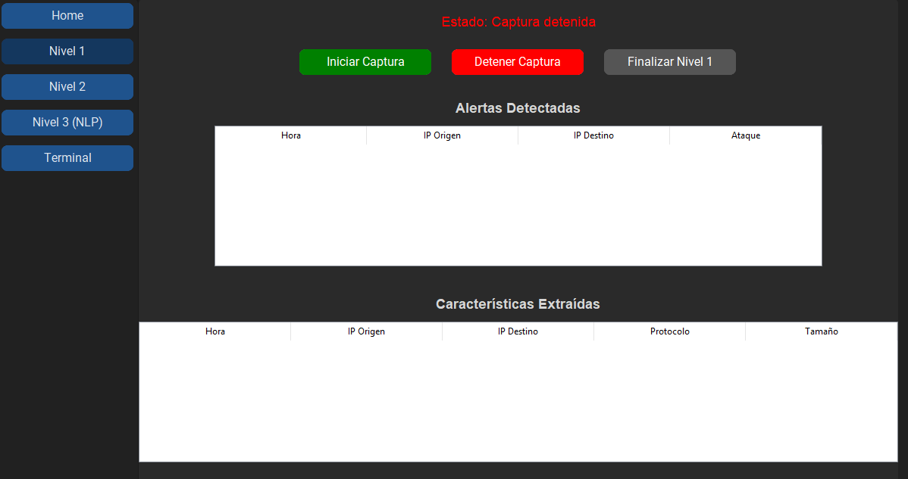
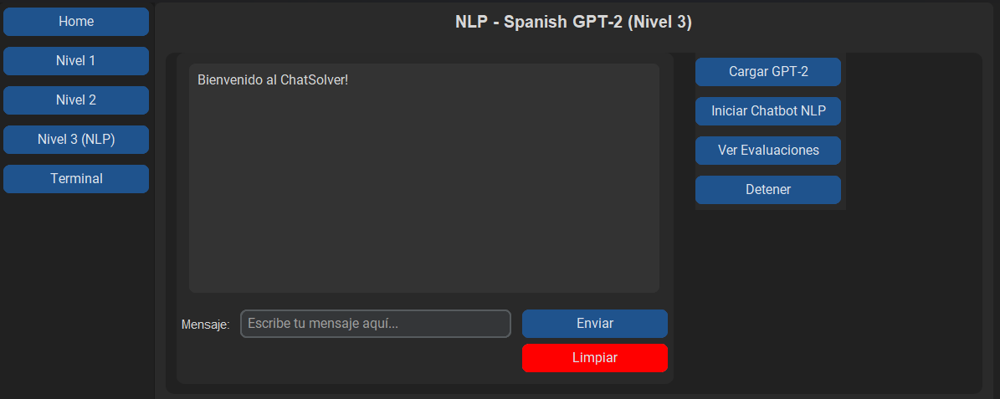
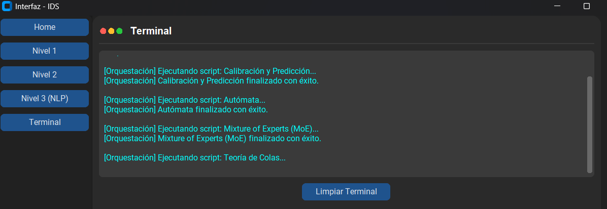
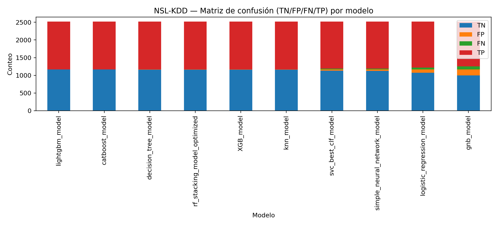
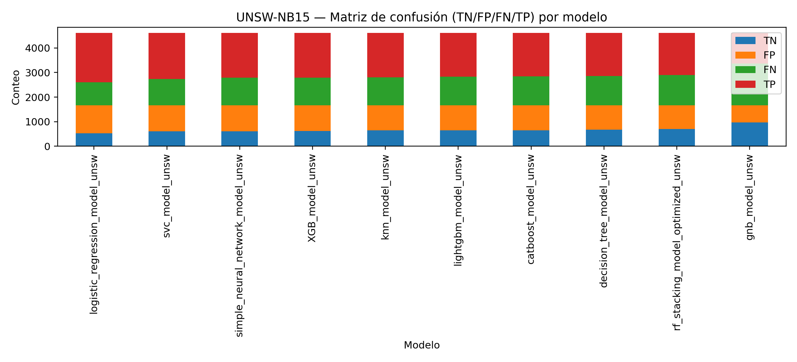

# 🛡️ IDS-ML Thesis · Sistema Experimental de Detección de Intrusiones


> **Trabajo de graduación:** *Construcción de un algoritmo de ciberseguridad con base en diferentes modelos matemáticos en inteligencia artificial.*

**IDS-ML Thesis** es un sistema experimental de ciberseguridad para la detección y el análisis de intrusiones en tráfico de red, este integra preprocesamiento de datos, clasificación supervisada, calibración de probabilidades, evaluación por lotes, priorización de alertas y correlación entre fuentes basadas en reglas y aprendizaje automático.

El estudio trabaja con **NSL-KDD**, **CICIDS2018** y **UNSW-NB15** y su propósito es analizar de forma reproducible el comportamiento de distintos modelos de Inteligencia Artificial frente a tráfico benigno y malicioso, y contrastar sus detecciones con **Snort**, **Suricata** y **Zeek**.

<p align="center">
  
</p>

---

## 📌 Tabla de contenido

- [Descripción](#-descripción)
- [Objetivo de investigación](#-objetivo-de-investigación)
- [Características principales](#-características-principales)
- [Tecnologías utilizadas](#-tecnologías-utilizadas)
- [Arquitectura del sistema](#-arquitectura-del-sistema)
- [Flujo experimental](#-flujo-experimental)
- [Interfaz del sistema](#-interfaz-del-sistema)
- [Datasets evaluados](#-datasets-evaluados)
- [Modelos y estrategias](#-modelos-y-estrategias)
- [Correlación entre IDS y ML](#-correlación-entre-ids-y-ml)
- [Resultados incluidos](#-resultados-incluidos)
- [Gráficas de evaluación](#-gráficas-de-evaluación)
- [Estructura del repositorio](#-estructura-del-repositorio)
- [Instalación](#-instalación)
- [Ejecución de los módulos](#-ejecución-de-los-módulos)
- [Reproducibilidad y estado del snapshot](#-reproducibilidad-y-estado-del-snapshot)
- [Gestión de archivos pesados](#-gestión-de-archivos-pesados)
- [Limitaciones](#-limitaciones)
- [Seguridad y uso responsable](#-seguridad-y-uso-responsable)
- [Autor](#-autor)
- [Licencia](#-licencia)

---

## 📖 Descripción

El sistema está organizado como un pipeline de evaluación de intrusiones a partir de flujos, registros de red y capturas PCAP donde cada dataset pasa por un proceso de limpieza, normalización y alineamiento de características; después se ejecutan modelos de clasificación binaria y se calculan métricas como **accuracy**, **precision**, **recall**, **F1-score**, **ROC-AUC**, especificidad y exactitud balanceada.

Además del análisis basado en ML, el proyecto conserva experimentos con IDS convencionales donde los eventos de Snort, Suricata, Zeek y las predicciones ML pueden asociarse mediante una clave canónica basada en protocolo, extremos de red y ventana temporal; y con ello se calculan coincidencias, intersecciones y similitud de Jaccard entre motores.

---

## ✨ Características principales

- Preprocesamiento específico para **NSL-KDD**, **CICIDS2018** y **UNSW-NB15**.
- Imputación, normalización, escalado y control de columnas por dataset.
- Persistencia de esquema y estadísticas de escalado para mantener compatibilidad entre entrenamiento e inferencia.
- Ejecución de modelos de clasificación binaria y cálculo de métricas.
- Calibración con `CalibratedClassifierCV` cuando el flujo experimental lo permite.
- Modos de ejecución `offline_split`, `offline_eval`, `offline_nosplit` y `online_live`.
- División estratificada configurable para entrenamiento, calibración y prueba.
- Autómata de evaluación por lotes con soporte de *chunks* y métricas persistidas.
- Priorización de resultados de mezcla de expertos mediante orden descendente de confianza.
- Plantillas JSON para explicaciones e interpretación de predicciones.
- Procesamiento de PCAP y logs de Snort, Suricata y Zeek en los experimentos NSL-KDD y UNSW-NB15.
- Correlación de alertas mediante claves canónicas, intersecciones y Jaccard.
- Interfaz de escritorio documentada para captura, resultados MoE, NLP y orquestación.

---

## 🛠️ Tecnologías utilizadas

| Área | Tecnología | Uso dentro del proyecto |
|---|---|---|
| Lenguaje | Python 3.12 | Implementación de preprocesamiento, inferencia, evaluación y utilidades. |
| Ciencia de datos | NumPy, pandas, SciPy | Manipulación y transformación de datos. |
| ML clásico | scikit-learn 1.6.1 | Modelos, escalado, particiones, calibración y métricas. |
| Gradient boosting | XGBoost, LightGBM, CatBoost | Clasificadores basados en árboles. |
| Redes neuronales | TensorFlow / Keras | Modelo neuronal simple incluido para CICIDS2018. |
| Persistencia de modelos | joblib, Keras | Carga y almacenamiento de artefactos ML. |
| Visualización | Matplotlib, Plotly | Figuras de métricas y matrices de confusión. |
| Análisis de paquetes | Scapy | Generación y transformación de tráfico PCAP en flujos experimentales. |
| IDS / monitoreo | Snort, Suricata, Zeek | Fuentes de eventos para la correlación de detecciones. |
| NLP explicativo | Haystack, Transformers | Dependencias de recuperación, generación y explicación. |
| Interfaz local | CustomTkinter | Interfaz de escritorio mostrada en las capturas del proyecto. |
| Empaquetado | PyInstaller | Dependencias preparadas para distribuir una interfaz local. |

---

## 🏗️ Arquitectura del sistema

```text
Datos de red / CSV / PCAP
          │
          ▼
┌───────────────────────────────────────────────┐
│ Nivel 1 · Preprocesamiento                    │
│ preprocess.py                                 │
│ • Limpieza e imputación                       │
│ • Escalado y codificación                     │
│ • Alineamiento de esquema por dataset         │
└───────────────────────────────────────────────┘
          │
          ▼
┌───────────────────────────────────────────────┐
│ Nivel 2 · Modelos y calibración               │
│ calibrated_predict.py                         │
│ • Carga de modelos                            │
│ • Split train / calibración / test            │
│ • Calibración de probabilidades               │
│ • Métricas y resultados registrados           │
└───────────────────────────────────────────────┘
          │
          ▼
┌───────────────────────────────────────────────┐
│ Nivel 2.1 · Autómata                          │
│ sub_automaton.py                              │
│ • Predicción por lotes                        │
│ • Control de chunks y checkpoints             │
│ • Evaluación offline / dos vías               │
└───────────────────────────────────────────────┘
          │
          ├───────────────────────┐
          ▼                       ▼
┌───────────────────────┐  ┌────────────────────────┐
│ Artefactos MoE         │  │ Nivel de colas          │
│ moe_output_*.json      │  │ sub_queues.py           │
│ Contribuciones y score │  │ Prioridad por confianza │
└───────────────────────┘  └────────────────────────┘
          │
          ▼
┌───────────────────────────────────────────────┐
│ Correlación de detecciones                     │
│ Snort + Suricata + Zeek + ML                   │
│ • Clave canónica                              │
│ • Intersecciones Venn                         │
│ • Índices de Jaccard                          │
└───────────────────────────────────────────────┘
```

---

## 🔄 Flujo experimental

```text
Dataset o PCAP
   │
   ▼
Preprocesamiento y esquema de características
   │
   ▼
Modelos supervisados / ensamble / red neuronal
   │
   ▼
Calibración y predicción
   │
   ├── Métricas por modelo
   ├── Matrices de confusión
   ├── Resultados registrados
   └── Salida para priorización
          │
          ▼
Correlación con Snort, Suricata y Zeek
          │
          ▼
Intersecciones, conteos y Jaccard
```

---

## 🖥️ Interfaz del sistema

La aplicación se organiza en una navegación por niveles. Las capturas muestran el flujo de interacción desarrollado para la investigación:

```text
Home
 ├── Nivel 1 · Captura de tráfico y características extraídas
 ├── Nivel 2 · Resultados MoE y priorización por colas
 ├── Nivel 3 · Consultas y explicaciones NLP
 └── Terminal · Orquestación de los módulos experimentales
```

### Nivel 1 · Captura y extracción de características

<p align="center">
  
</p>

Este nivel presenta los controles para iniciar, detener y finalizar una captura. La interfaz dispone de una tabla de **alertas detectadas** y otra para las **características extraídas**, como hora, IP de origen, IP de destino, protocolo y tamaño.

---

### Nivel 2 · MoE y colas de prioridad

<p align="center">
  
</p>

El Nivel 2 permite seleccionar el dataset experimental y ejecutar el flujo de **MoE + Queues**. La interfaz muestra:

- Riesgo de intrusión y riesgo promedio.
- Puntajes por clase generados por el mecanismo de mezcla de expertos.
- Probabilidades por modelo para las clases `0` y `1`.
- Badges visuales para priorizar resultados.

---

### Nivel 3 · Módulo NLP

<p align="center">
  
</p>

El módulo NLP plantea una interfaz para cargar el modelo, iniciar el chatbot, consultar evaluaciones y enviar preguntas. Su propósito es acompañar la detección con una capa de explicación o consulta en lenguaje natural.

---

### Terminal de orquestación

<p align="center">
  
</p>

La terminal registra el avance de la orquestación. La captura evidencia la ejecución secuencial de **Calibración y Predicción**, **Autómata**, **Mixture of Experts (MoE)** y **Teoría de Colas**.

---

### Vista rápida

| Nivel 1 | Nivel 2 |
|---|---|
|  |  |

| Nivel 3 | Terminal |
|---|---|
|  |  |

---

## 🗂️ Datasets evaluados

| Dataset | Rol en el proyecto | Evidencia incluida en el snapshot |
|---|---|---|
| **NSL-KDD** | Evaluación de clasificación y flujo de correlación basado en PCAP Ethernet sintetizado. | Métricas JSON, logs, CSV de correlación y figura de matriz de confusión. |
| **CICIDS2018** | Evaluación de modelos binarios y artefactos de resultados de gran volumen. | Métricas JSON, modelo Keras y resultados registrados. |
| **UNSW-NB15** | Evaluación de modelos y correlación multifuente con PCAP convertido de SLL a Ethernet. | Métricas JSON, configuración Snort, logs y tablas de intersección. |

---

## 🤖 Modelos y estrategias

| Grupo | Modelos / estrategia |
|---|---|
| Lineales | Regresión logística. |
| Vecinos y probabilísticos | KNN, Gaussian Naive Bayes. |
| Árboles | Árbol de decisión, Random Forest y stacking basado en Random Forest. |
| Boosting | XGBoost, LightGBM y CatBoost. |
| Margen máximo | Support Vector Classifier (SVC). |
| Deep learning | Red neuronal simple implementada con TensorFlow/Keras. |
| Ensamble | Stacking y artefactos de mezcla de expertos (MoE). |
| Priorización | Ordenamiento de salidas MoE por `score` o `confidence`. |

El archivo `src/Container/nivel_2/models.txt` describe además un uso académico de Optuna, algoritmo genético y algoritmo clonal. La disponibilidad efectiva de esos entrenadores depende de los archivos fuente y artefactos que acompañen la versión publicada.

---

## 🔗 Correlación entre IDS y ML

La correlación asocia eventos de motores distintos mediante una **clave canónica**. En los experimentos se usan datos de protocolo, direcciones, puertos y una ventana temporal; para ICMP los puertos se normalizan a `0`. El flujo NSL-KDD documentado utiliza una ventana de `2` segundos.

### Fuentes correlacionadas

```text
Snort alerts ────────┐
Suricata alerts ─────┼──► Clave canónica ─► Tabla enriquecida ─► Venn / Jaccard
Zeek conn.log ───────┤
Predicciones ML ─────┘
```

### Snapshot NSL-KDD

| Indicador | Resultado incluido |
|---|---:|
| Claves canónicas analizadas | 12,598 |
| Eventos positivos Snort | 12,598 |
| Eventos positivos Suricata | 0 |
| Eventos positivos Zeek | 12,598 |
| Eventos positivos ML | 1,291 |
| Jaccard Snort ↔ Zeek | 1.000000 |
| Jaccard Snort ↔ ML | 0.102477 |

En esta ejecución Suricata no produjo alertas, por lo que las intersecciones que lo involucran no son comparables como medida de desacuerdo entre motores.

### Snapshot UNSW-NB15

| Indicador | Resultado incluido |
|---|---:|
| Claves canónicas analizadas | 43,293 |
| Eventos positivos Snort | 4,050 |
| Eventos positivos Suricata | 3,819 |
| Eventos positivos Zeek | 43,284 |
| Eventos positivos ML | 2,604 |
| Intersección de los cuatro motores | 66 |
| Jaccard Snort ↔ Suricata | 0.150775 |
| Jaccard Snort ↔ Zeek | 0.093391 |
| Jaccard Suricata ↔ Zeek | 0.088181 |
| Jaccard Zeek ↔ ML | 0.060161 |

Estos valores corresponden a una corrida concreta. Deben interpretarse junto con las reglas activas, definición de evento, transformación del PCAP, ventana temporal y configuración de cada motor.

---

## 📊 Resultados incluidos

Las tablas resumen los mejores resultados de **F1-score** encontrados en la sección `test` de los archivos `metrics_models_*.json` incluidos en el snapshot.

### NSL-KDD

| Modelo | Accuracy | F1-score | ROC-AUC |
|---|---:|---:|---:|
| `rf_stacking_model_optimized` | 99.8413% | **99.8524%** | 99.9608% |
| `lightgbm_model` | 99.8413% | 99.8523% | **99.9958%** |
| `decision_tree_model` | 99.8016% | 99.8154% | 99.8745% |
| `catboost_model` | 99.8016% | 99.8153% | 99.9961% |

### CICIDS2018

| Modelo | Accuracy | F1-score | ROC-AUC |
|---|---:|---:|---:|
| `LightGBM_bin_cicids2018_cicids2018` | **99.9982%** | **99.9920%** | 100.0000% |
| `catboost_bin_2018_cicids2018` | 99.9963% | 99.9839% | 100.0000% |
| `DecisionTree_bin_cicids2018_cicids2018` | 99.9952% | 99.9791% | 99.9957% |
| `XGB_model_bin_cicids2018_cicids2018` | 99.8111% | 99.1841% | 99.9988% |

### UNSW-NB15

| Modelo | Accuracy | F1-score | ROC-AUC |
|---|---:|---:|---:|
| `logistic_regression_model_unsw` | **55.3168%** | **66.1738%** | 50.2667% |
| `simple_neural_network_model_unsw` | 53.9280% | 63.9497% | 49.8394% |
| `svc_model_unsw` | 53.7326% | 63.9255% | 49.9538% |
| `XGB_model_unsw` | 53.6675% | 63.5852% | 49.3842% |

---

## 📈 Gráficas de evaluación


### Matriz de confusión apilada — NSL-KDD

<p align="center">
  
</p>

### Matriz de confusión apilada — UNSW-NB15

<p align="center">
  
</p>

### ROC-AUC por modelo — UNSW-NB15

<p align="center">
  
</p>

---

## 📁 Estructura del repositorio

La siguiente estructura representa el contenido del snapshot y los recursos visuales del README:

```text
IDS-ML-Thesis/
│
├── README.md
├── requirements.txt
│
├── assets/
│   └── readme/
│       ├── 01-level-1-captura.png
│       ├── 02-level-2-moe.png
│       ├── 03-level-3-nlp.png
│       ├── 04-terminal-orquestacion.png
│       ├── 05-nslkdd-confusion.png
│       ├── 06-unsw-confusion.png
│       └── 07-unsw-roc-auc.png
│
├── src/
│   └── Container/
│       ├── extensions/
│       │   ├── Auto/
│       │   │   ├── calibrated_predict.py
│       │   │   ├── preprocess.py
│       │   │   └── sub_automaton.py
│       │   └── Queue/
│       │       └── sub_queues.py
│       │
│       ├── jsons/
│       │   ├── res/
│       │   │   ├── nslkdd_feature_list.json
│       │   │   ├── test_data_cont_cicids2018.csv
│       │   │   ├── unsw15_feature_list.json
│       │   │   └── unsw15_scaler_stats.json
│       │   ├── test/
│       │   │   └── metrics_models_*.json
│       │   └── web/
│       │       ├── dataset.json
│       │       └── queues_output_*.json
│       │
│       ├── nivel_2/
│       │   ├── cicids2018/
│       │   │   └── simple_neural_network_model_bin_cicids2018.keras
│       │   └── models/
│       │       └── README.txt
│       │
│       └── nivel_3/
│           └── __pycache__/
│
├── nsl_ids/
│   ├── README.txt
│   ├── parse_snort_fast_to_csv.py
│   ├── parse_suricata_eve_to_csv.py
│   ├── overlap/
│   ├── snort-logs/
│   ├── suri-logs/
│   └── zeek-logs/
│
├── unsw_ids/
│   ├── conf/snort/
│   ├── overlap/
│   ├── snort-logs/
│   ├── suri-logs/
│   └── zeek-logs/
```

---

## ⚙️ Instalación

### 1. Clonar el repositorio

```bash
git clone https://github.com/SalazarPaulo/IDS-ML-Thesis.git
cd IDS-ML-Thesis
```

> Cambia la URL anterior por el nombre definitivo del repositorio cuando lo publiques.

### 2. Crear y activar un entorno virtual

**Windows PowerShell**

```powershell
py -3.12 -m venv .venv
.\.venv\Scripts\Activate.ps1
```

**Linux / WSL / macOS**

```bash
python3.12 -m venv .venv
source .venv/bin/activate
```

### 3. Instalar dependencias

```bash
python -m pip install --upgrade pip
pip install -r requirements.txt
```

> La instalación reúne dependencias de ML, TensorFlow, NLP y visualización. Puede requerir tiempo y espacio en disco, especialmente en Windows.

---

## ▶️ Ejecución de los módulos

Los scripts consultan rutas centralizadas desde módulos internos como `utilities.global_paths`. Antes de ejecutar el pipeline completo, verifica que las rutas, CSV preprocesados, modelos y directorios de salida existan en tu copia local.

### Preprocesamiento

```bash
python src/Container/extensions/Auto/preprocess.py
```

Procesa los datasets encontrados en las rutas configuradas y genera versiones alineadas para inferencia.

### Calibración y evaluación

```bash
python src/Container/extensions/Auto/calibrated_predict.py --mode offline_eval
```

Otros modos disponibles:

```bash
python src/Container/extensions/Auto/calibrated_predict.py --mode offline_split
python src/Container/extensions/Auto/calibrated_predict.py --mode offline_nosplit
python src/Container/extensions/Auto/calibrated_predict.py --mode online_live
```

### Autómata de evaluación

```bash
python src/Container/extensions/Auto/sub_automaton.py
```

El comportamiento se controla mediante variables de entorno como:

```text
EVAL_OFFLINE=1
EVAL_OFFLINE_TWO_WAY=0
AUTOMATON_CHUNK=<tamaño_de_lote>
RUN_ONLY_NSLKDD=0
```

### Priorización de resultados MoE

```bash
python src/Container/extensions/Queue/sub_queues.py
```

El módulo toma salidas como `moe_output_*.json`, ordena los elementos por confianza y escribe una estructura JSON consumible por la interfaz.

---

## ⚠️ Limitaciones

- El sistema está diseñado para investigación académica y experimentación offline.
- Una puntuación alta en un dataset no garantiza desempeño equivalente en redes reales.
- La calidad de resultados depende del particionado, balance de clases, selección de variables y prevención de fuga de información.
- La corrida UNSW-NB15 incluida requiere revisión adicional antes de presentarse como resultado final comparativo.
- La correlación entre IDS no evalúa únicamente la calidad de los motores: también depende de reglas activas, normalización del PCAP, ventanas temporales y definición de evento.
- Esta versión no debe considerarse un sistema de prevención autónomo listo para producción.

---

## 👨‍💻 Autor

**Paulo Salazar**

- GitHub: [@SalazarPaulo](https://github.com/SalazarPaulo)
- Proyecto académico de Ingeniería de Sistemas y Computación.
- Línea de trabajo: Inteligencia Artificial aplicada a ciberseguridad y detección de intrusiones.

---

## 📄 Licencia

El código fuente de este proyecto se distribuye bajo la licencia **PolyForm Noncommercial 1.0.0**.

Se permite su uso, estudio, modificación y redistribución para fines personales, académicos, educativos, de investigación y otros fines no comerciales. Cualquier uso comercial requiere autorización previa y expresa del autor.

Consulta el archivo [LICENSE](./LICENSE) para leer los términos completos.

> **Nota sobre datasets:** NSL-KDD, CICIDS2018, UNSW-NB15 y cualquier conjunto de datos externo conservan sus propias condiciones de uso. Esta licencia aplica únicamente al código, documentación y recursos originales de este repositorio.


